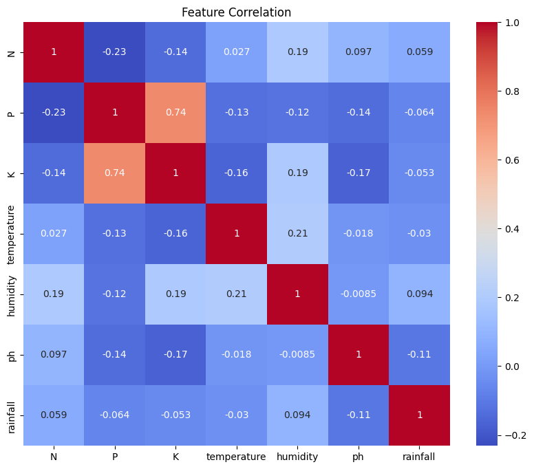
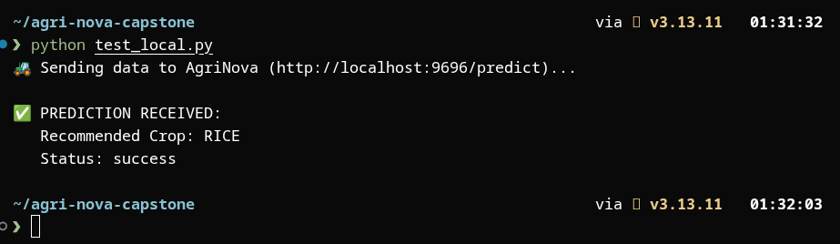
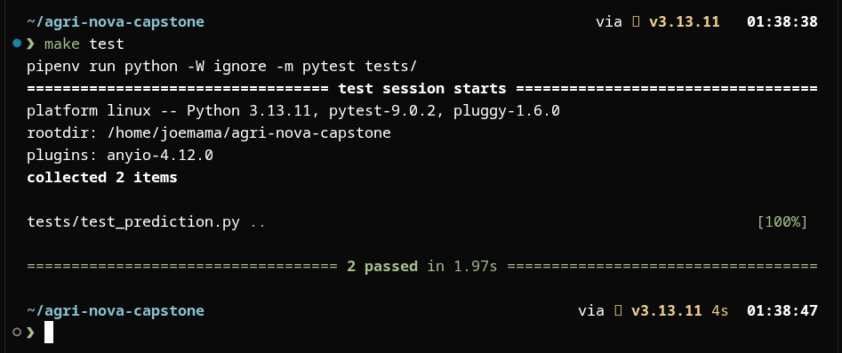

# 🌾 AgriNova: Intelligent Crop Recommendation System


> **ML Zoomcamp Capstone**
> *An end-to-end Machine Learning Engineering solution for precision agriculture, deployed with Docker and Flask.*

---

## 📖 Project Overview
**AgriNova** solves a critical problem for farmers: **"What should I plant to maximize yield?"**

Traditional farming often relies on intuition. AgriNova uses Machine Learning to analyze soil chemistry (Nitrogen, Phosphorus, Potassium) and environmental patterns to recommend the scientifically optimal crop. The system is built as a **production-grade microservice** capable of serving real-time predictions.

### Key Features
* **Precision:** 99.3% accuracy using Random Forest.
* **Speed:** <100ms inference time via Flask API.
* **Robustness:** Fully containerized with Docker for "run anywhere" reliability.
* **Quality:** Automated validation using Pydantic and unit testing with Pytest.

---

## 📊 The Dataset
The model is trained on the **Crop Recommendation Dataset** (2,200 samples), covering 22 unique crops.

| Feature | Description | Role |
| :--- | :--- | :--- |
| **N** | Ratio of Nitrogen content in soil | Feature |
| **P** | Ratio of Phosphorous content in soil | Feature |
| **K** | Ratio of Potassium content in soil | Feature |
| **Temperature** | Average temperature in degrees Celsius | Feature |
| **Humidity** | Relative humidity in % | Feature |
| **pH** | pH value of the soil | Feature |
| **Rainfall** | Rainfall in mm | Feature |
| **label** | The optimal crop (e.g., Rice, Coffee) | **Target** |

---

## 🛠 Workflow Pipeline
This project follows a rigorous Engineering lifecycle:

1.  **Ingestion & Cleaning:** Validated data integrity and handled outliers.
2.  **Exploratory Data Analysis (EDA):** Visualized soil nutrient distributions.
3.  **Model Selection:** Benchmarked Logistic Regression, XGBoost, and Random Forest.
4.  **Containerization:** Packaged dependencies into a lightweight Docker image.
5.  **Deployment:** Exposed the model via a REST API endpoint.

---

## 🔍 Exploratory Data Analysis (EDA)

### 1. Class Distribution
The dataset is perfectly balanced across all 22 crop types, ensuring the model does not bias toward majority classes.


### 2. Feature Correlation
We analyzed feature interactions to understand soil dynamics.
* **Key Insight:** Phosphorus (P) and Potassium (K) show a high positive correlation, which is biologically consistent with fertilizer composition.


---

## 🏆 Model Performance
We evaluated three algorithms to find the best balance of accuracy and inference speed.

| Model | Accuracy | Outcome |
| :--- | :--- | :--- |
| **Logistic Regression** | 97.05% | Good baseline, but struggles with non-linear patterns. |
| **XGBoost** | 98.64% | Excellent, but heavier dependency. |
| **Random Forest** | **99.32%** | **✅ WINNER** - Highest accuracy and robustness. |

---

## 📸 Proof of Life (Demo)

### ✅ Successful Prediction API
Sending a POST request with soil data returns the recommended crop instantly.


### ✅ Automated Test Suite
The project includes a comprehensive test suite (checking API response, validation errors, and model loading).


---

## 🚀 How to Run (Step-by-Step)

### Option 1: Docker (Recommended)
Run the application in an isolated container.

**1. Build the Image**
```bash
make docker-build
```

**2. Start the Container**
```bash
make docker-run
```
*The app will be live at `http://0.0.0.0:9696`*

### Option 2: Local Python Execution
If you prefer running without Docker:
```bash
make setup   # Install dependencies
make run     # Start Flask server
```

---

## 📡 API Usage

**Endpoint:** `POST /predict`

**Example Request:**
```bash
curl -X POST http://localhost:9696/predict \
    -H "Content-Type: application/json" \
    -d '{"N": 90, "P": 42, "K": 43, "temperature": 20.8, "humidity": 82.0, "ph": 6.5, "rainfall": 202.9}'
```

**Response:**
```json
{
    "recommended_crop": "rice",
    "status": "success"
}
```

---

## 📂 Repository Structure

```bash
agri-nova-capstone/
├── data/                    # Raw Dataset
├── images/                  # EDA & Screenshot assets
├── models/                  # Serialized Model (model.bin)
├── src/                     # Application Source Code
│   ├── predict.py           # Flask API Endpoint
│   ├── train.py             # Training Script
│   └── schema.py            # Pydantic Validation
├── tests/                   # Pytest Suite
├── Dockerfile               # Container Config
├── Makefile                 # Task Automation
└── README.md                # Project Documentation
```

---

## 👨‍💻 Author
**Abhishek222983101**
*| ML Zoomcamp Capstone | 2025*
